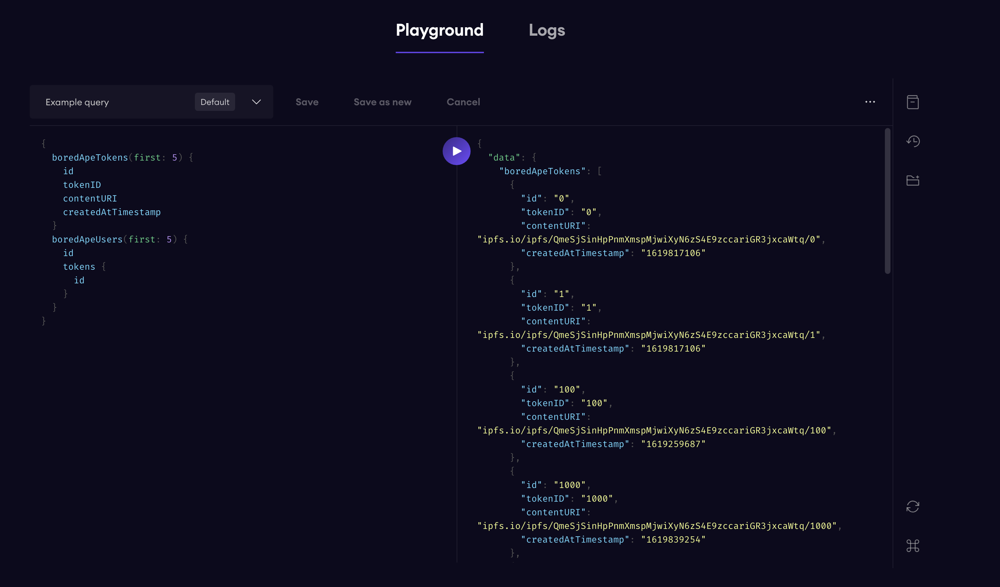

# 使用 The Graph 检索 BAYC NFT 的基本信息

BAYC ETH Mainet: 0xBC4CA0EdA7647A8aB7C2061c2E118A18a936f13D

我们定义的 GraphQL Entity

- BoredApeToken NFT 信息
    - Token ID
    - Content URI
    - Created Timestamp
    - ...
- BoredApeUser 用户信息
    - ID (Address)
    - Tokens (Token IDs) 

Playground: https://thegraph.com/hosted-service/subgraph/liyang-ust/camp?selected=playground


API: https://api.thegraph.com/subgraphs/name/liyang-ust/camp

## 目录结构

- schema.graphql GraphQL配置
  定义了GraphQL查询时的所有可查询对象极其属性
  这里BoredApeToken具有tokenID, contentURI等可查询属性
  BoredApeUser具有tokens等可查询属性

- subgraph.yaml SubGraph检索配置
  定义了该Subgraph的检索规则
  包括 合约地址、ABI、起始区块等基本信息
  以及 合约中具体监听的所有事件信息 本例中为Transfer事件

- src/bored-ape.ts 检索过程代码
  根据监听的事件 来生成最终待查询的GraphQL实体
  这里根据Transfer事件中的参数 来初始化/更新代币信息和拥有者信息

## 操作流程

1. 跟随官方教程初始化之后 修改对应文件到这个仓库的版本

```
graph init --from-contract <BAYC Address>
```

   
2. 直接下载该仓库

### 下载代码仓库
```
git clone https://github.com/LIYANG-UST/graphcamp
```

### 生成Graph配置
```
graph codegen
graph build
```

### 部署到自己的Hosted Service中
```
graph auth --product hosted-service <Your Access Token>
graph deploy --product hosted-service <Your Github Name>/<Your Graph Name>
```